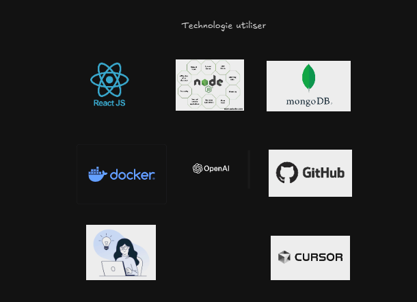
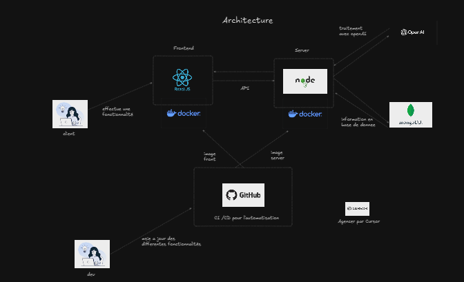
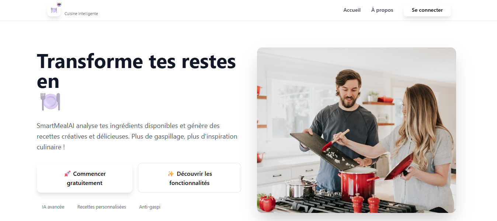

# SmartMealAI

> **L’assistant culinaire intelligent pour des repas sains, rapides et inspirants !**

---

## 🚀 Présentation
SmartMealAI est une application web moderne qui génère des idées de repas personnalisées grâce à l’IA. Elle propose des recettes adaptées à vos envies, vos contraintes et votre frigo, tout en offrant une expérience utilisateur fluide, gourmande et professionnelle.

---

## 🛠️ Stack technique

- **Frontend** : React.js + TailwindCSS
- **Backend** : Node.js (Express)
- **Base de données** : MongoDB
- **Conteneurisation** : Docker
- **IA & NLP** : OpenAI API
- **CI/CD & Versioning** : GitHub
- **Dev Tooling** : Cursor

<p align="center">
  <!-- Insérer ici l'image des logos technos -->
  
</p>

---

## 🏗️ Architecture

L’architecture repose sur une séparation claire frontend/backend, orchestrée par Docker pour un déploiement simple et reproductible.

- **Frontend** : Interface utilisateur (React) —> API REST
- **Backend** : Serveur Node.js —> MongoDB (stockage) & OpenAI (génération IA)
- **CI/CD** : GitHub Actions pour automatiser les tests et le déploiement
- **Dev** : Collaboration et agilité grâce à Cursor

<p align="center">
  <!-- Insérer ici le schéma d'architecture -->
  
</p>

---

## ✨ Fonctionnalités principales

- **Landing page moderne** : design gourmand, responsive, animations, présentation claire du service
- **Authentification sécurisée** : inscription/connexion par email & mot de passe, formulaires UX avancée
- **Suggestions de repas IA** : propose des idées de plats selon vos goûts, allergies, temps, ingrédients
- **Recettes inspirantes** : fiches recettes détaillées (calories, temps, portions, image)
- **Fonctionnalités avancées** :
  - Recherche intelligente
  - Filtrage par régime (végétarien, rapide, etc.)
  - Historique des suggestions
  - Ajout aux favoris
- **Section “Comment ça marche”** : explication du process IA
- **FAQ interactive**
- **Témoignages utilisateurs**
- **Navigation fluide** : React Router, navbar sticky, transitions
- **Expérience mobile optimisée**

---

## ⚡ Installation & Lancement

### Prérequis
- Node.js >= 18
- Docker (optionnel mais recommandé)

### Lancer en mode développement
```bash
# Installer les dépendances
npm install

# Lancer le frontend (Vite)
npm run dev
```

### Lancer avec Docker
```bash
docker-compose up --build
```

---

## 🙌 Crédits & Inspirations
- UI inspirée par Cursor, ViteJS, shadcn/ui
- Illustrations : [undraw.co](https://undraw.co/)
- API IA : OpenAI
- Merci à tous les contributeurs !

---

## 📷 Aperçu

<p align="center">
  <!-- Screenshots de l'app -->
  
</p>

---

## 📝 Licence
MIT
